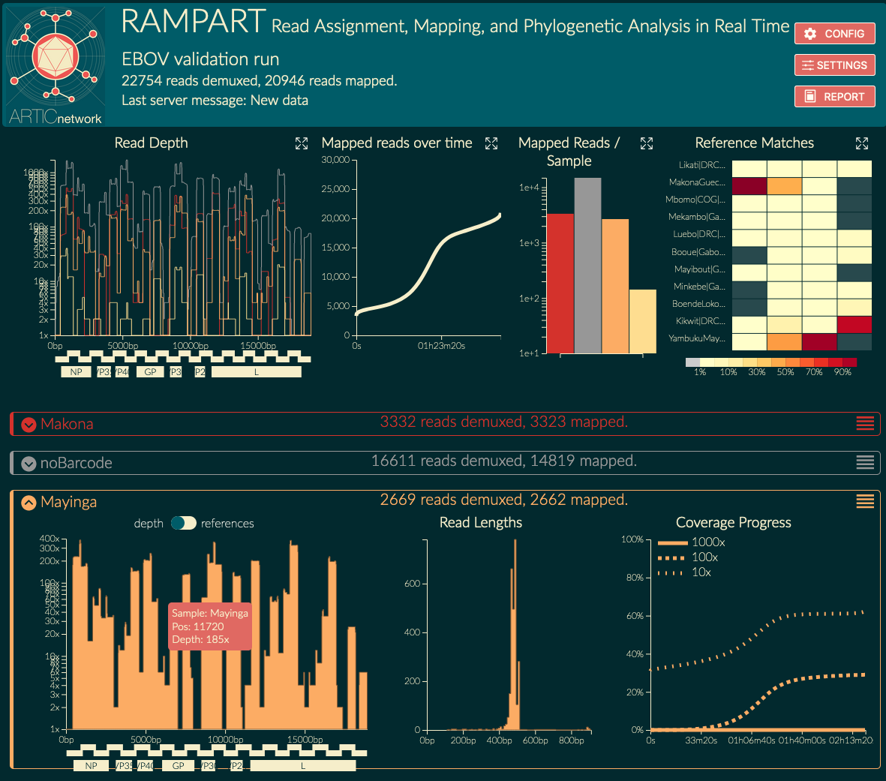

# RAMPART
Read Assignment, Mapping, and Phylogenetic Analysis in Real Time

## TL;DR
RAMPART runs concurrently with MinKNOW and shows you demuxing / mapping results in real time.

## Motivation
Time is crucial in outbreak analysis, and recent advancements in sequencing prep now mean that sequencing is the bottleneck for many pathogens.
Furthermore, the small size of many pathogens mean that insightful sequence data is obtained in a matter of minutes.
RAMPART run concurrently with MinION sequencing of such pathogens.
It provides a real-time overview of genome coverage and reference matching for each barcode.
(Consensus sequence creation and phylogenetic placement is currently under development.)

RAMPART is primarily designed to work with amplicon-based primer schemes (e.g. for [ebola](https://github.com/artic-network/primer-schemes)), but may be used with most other datasets.

## Documentation

* [Quick Start](docs/quickstart.md)
* [Advanced Installation](docs/advanced.md)
* [Running demos](docs/old_examples.md)
* [Instructions for sequencing & basecalling](docs/sequencing.md)
* [Technical details & file formats](docs/details.md)
* [Developing](docs/developing.md)

* [How it works](docs/overview.md)

## Status

RAMPART is in development with a publication forthcoming.
Please [get in contact](https://twitter.com/hamesjadfield) if you have any issues.

## Spotted in the field

RAMPART has been deployed to sequence
* [Yellow Fever Virus in Brazil](https://twitter.com/Hill_SarahC/status/1149372404260593664)
* [ARTIC workshop in Accra, Ghana](https://twitter.com/george_l/status/1073245364197711874)

