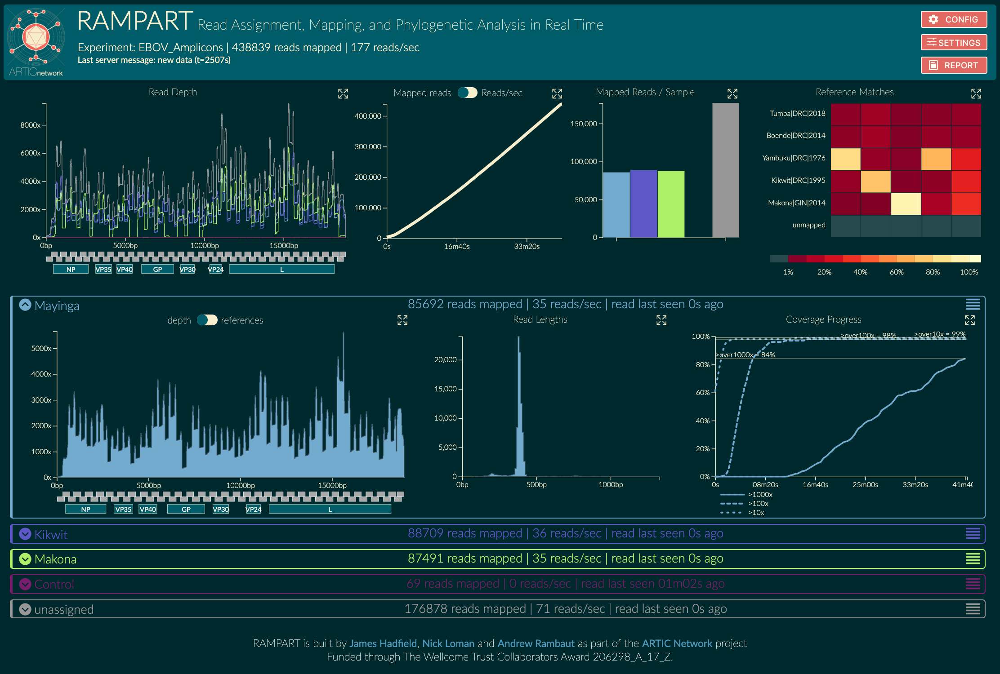

# Running the provided examples

This article presupposes that you have [installed RAMPART](installation) by cloning the [GitHub repository](https://github.com/artic-network/rampart).

We've provided an example to both test out RAMPART and to see how a set of working configuration files look.
Start by navigating into the example directory:

```bash
cd rampart/example_data/20181008_1405_EBOV
```

Here you'll see a folder (`./fastq/pass`) with a few fastq files, basecalled by MinKNOW during an Ebola validation run.
There's also a `run_configuration.json` file which defines some of the parameters for this run, such as the barcode-sample name mapping.
The rampart GitHub repo also includes an example protocol for Ebola virus (EBOV) at `rampart/example_protocols/EBOV`, which we'll feed into RAMPART for this example.


Please refer to [setting up for your own run](setting-up.md) for how to create these files & protocols yourself.


We can run this example for ourselves via:
```bash
rampart --protocol ../../example_protocols/EBOV --clearAnnotated
```

> The `--clearAnnotated` flag will remove any results in case we've already run this example.

By opening a browser at [localhost:3000](http://localhost:3000) we can see the data being processed & interact with the results.
It should look something like this:



